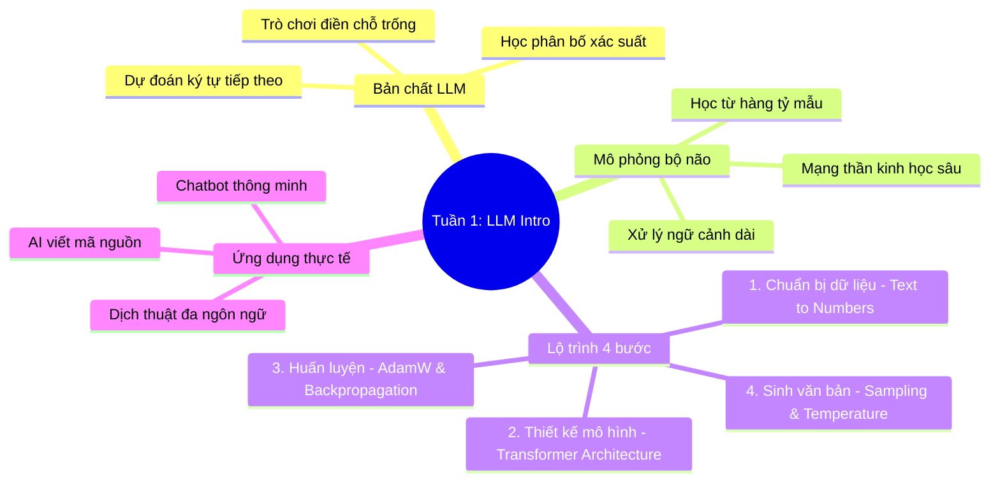

# Tuần 1: Giới thiệu AI & Mô hình ngôn ngữ lớn (LLM) — Topic Overview
> **Mục tiêu học tập:** Hiểu bản chất các mô hình ngôn ngữ lớn hoạt động bằng cơ chế đoán từ/ký tự tiếp theo; nắm vững 4 bước xây dựng một mô hình ngôn ngữ lớn.

---

