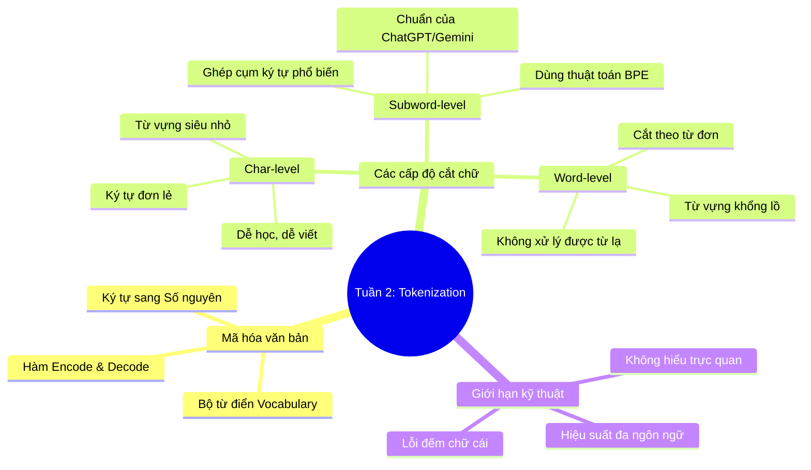

# Tuần 2: Tokenization — Topic Overview
> **Mục tiêu học tập:** Hiểu rõ cách Tokenizer cắt nhỏ văn bản và mã hóa thành các số nguyên (Token IDs); phân biệt được char-level tokenization và Byte Pair Encoding (BPE).

---

