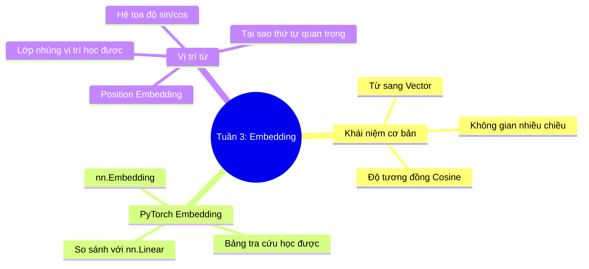

# Tuần 3: Embedding & Position — Topic Overview
> **Mục tiêu học tập:** Hiểu rõ khái niệm không gian vector nhiều chiều; cơ chế hoạt động của lớp `nn.Embedding`; và tầm quan trọng của Position Embedding trong việc giữ thứ tự câu.

---

