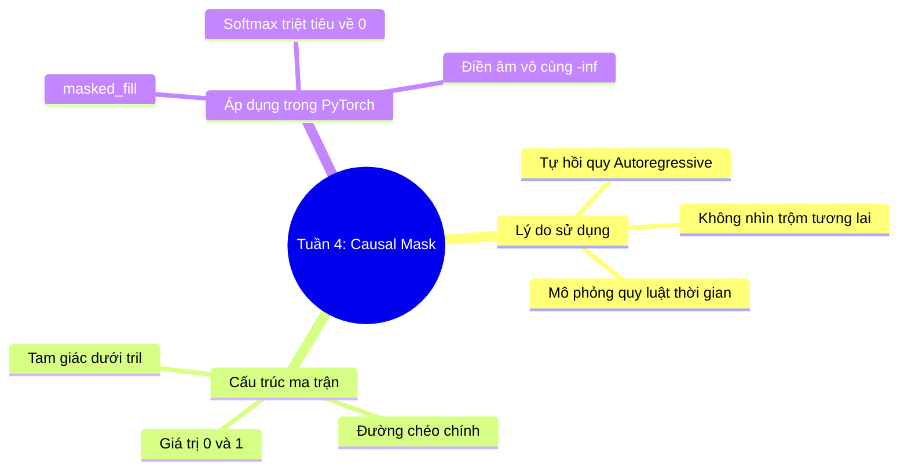

# Tuần 4: Causal Masking — Topic Overview
> **Mục tiêu học tập:** Hiểu rõ tại sao cần cơ chế Tam giác dưới (Causal Masking); cấu trúc ma trận tam giác dưới `tril`; và cách áp dụng phép `masked_fill` bằng giá trị $-\infty$ trong Attention.

---

