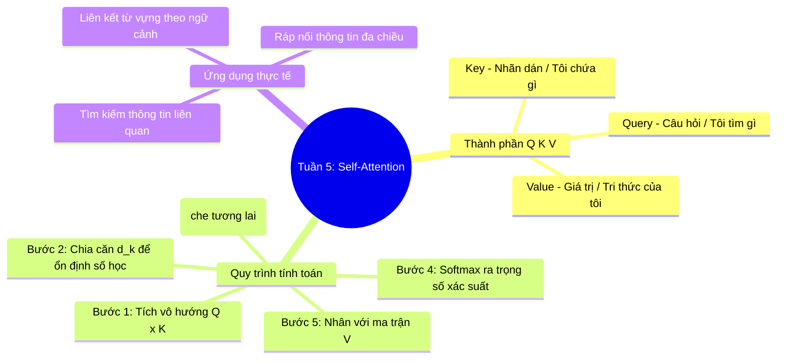

# Tuần 5: Self-Attention — Topic Overview
> **Mục tiêu học tập:** Nắm vững cấu trúc thuật toán Self-Attention hoàn chỉnh; giải thích được ý nghĩa và cơ chế tính toán của các vector Query (Q), Key (K), Value (V); hiểu cách chuẩn hóa bằng chia căn bậc hai chiều vector ($\sqrt{d_k}$) và Softmax.

---

