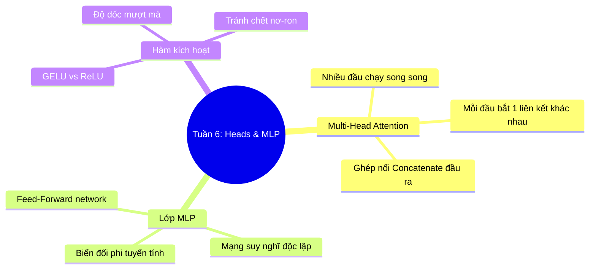

# Tuần 6: Multi-Head Attention & Lớp MLP — Topic Overview
> **Mục tiêu học tập:** Hiểu nguyên lý hoạt động song song của cơ chế Multi-Head Attention; cách chia nhỏ chiều vector để phân bổ cho các đầu chú ý; vai trò của lớp MLP (Feed-Forward) và các hàm phi tuyến tính.

---

