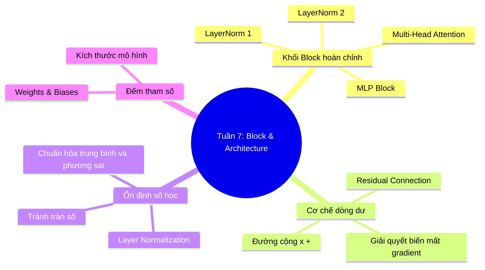

# Tuần 7: Transformer Block & Architecture — Topic Overview
> **Mục tiêu học tập:** Hiểu cách ráp nối Attention và MLP thành một khối Transformer hoàn chỉnh; vai trò của Residual Connection và Layer Normalization trong việc ổn định luồng dữ liệu.

---

