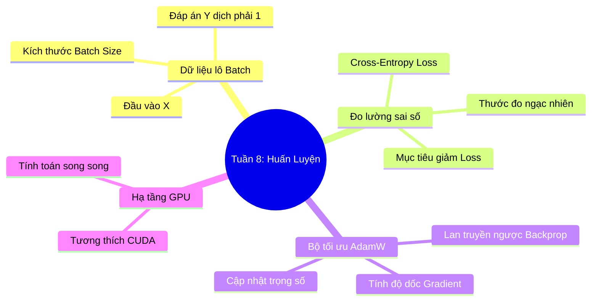

# Tuần 8: Huấn Luyện Mô Hình — Topic Overview
> **Mục tiêu học tập:** Hiểu rõ cấu trúc vòng lặp huấn luyện (Training Loop); cách chuẩn bị lô dữ liệu (Batching); phép toán Cross-Entropy Loss; và thuật toán tối ưu hóa AdamW.

---

