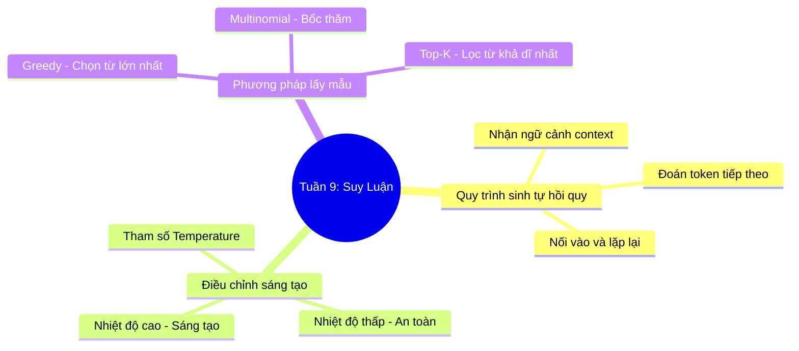

# Tuần 9: Suy Luận & Lấy Mẫu — Topic Overview
> **Mục tiêu học tập:** Hiểu quy trình sinh văn bản tự hồi quy (Autoregressive Inference); vai trò của tham số Temperature; và cách hoạt động của phương pháp lấy mẫu xác suất Multinomial, Top-K.

---

