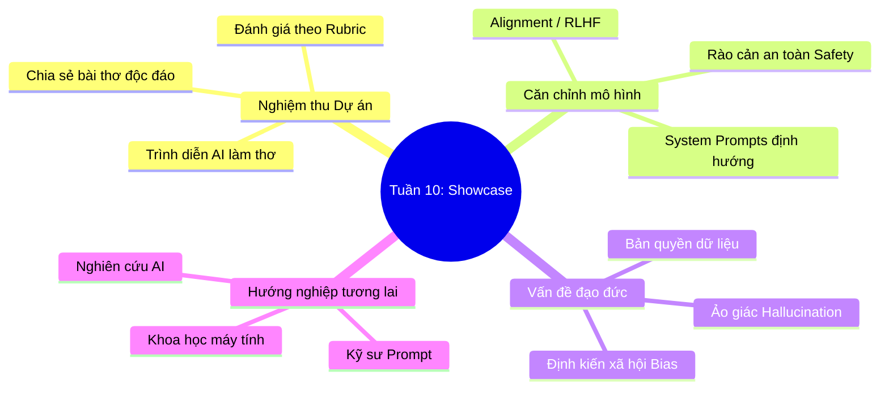

# Tuần 10: Showcase & Đạo Đức AI — Topic Overview
> **Mục tiêu học tập:** Thuyết trình và nghiệm thu dự án AI làm thơ cá nhân; tìm hiểu quy trình căn chỉnh mô hình (Alignment/RLHF); thảo luận các vấn đề đạo đức, định kiến và ảo giác AI.

---

